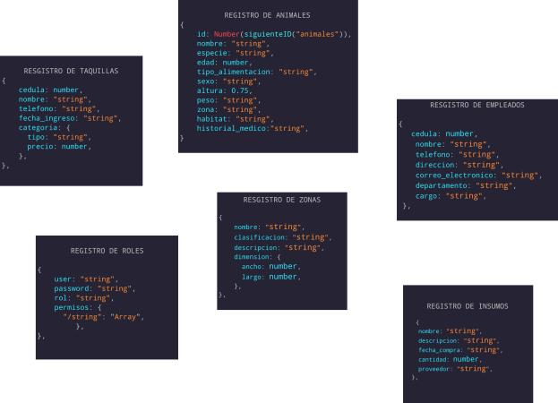

## ZOOLÓGICO CAMPUS 

Versión:  

- MongoDB 7.0

  


Sumérgete en nuestro emocionante proyecto que simula un completo sistema de funcionalidades de un zoológico, impulsado por tecnologías JavaScript y MongoDB. Experimenta la emocionante exhibición de animales y explora el mundo intrigante de la arqueología, todo en un ambiente virtual.

Nuestro objetivo es brindarte una experiencia educativa única al conectar la vida silvestre con la historia humana. Utilizamos tecnologías avanzadas como JavaScript y MongoDB para recrear la diversidad de un zoológico, permitiéndote explorar animales en sus hábitats naturales y descubrir artefactos históricos en un solo lugar.

Mediante programas educativos integrales y exhibiciones multidisciplinarias, celebramos tanto la biodiversidad como la riqueza cultural, al tiempo que promovemos la sensibilización y la conservación. Únete a nosotros en este emocionante viaje de aprendizaje, donde la tecnología se combina con la naturaleza y la historia para ofrecerte una experiencia inmersiva única. ¡Bienvenido a nuestro proyecto de zoológico virtual!


## OBJETIVO Y ALCANCE

Este proyecto tiene como objetivo desarrollar un sistema de gestión para un zoológico, que permitirá el registro y seguimiento de animales, empleados, insumos, zonas del zoológico y tickets de entrada. El sistema se basará en una base de datos MongoDB y seguirá las mejores prácticas de desarrollo, incluyendo el uso de patrones DTO (Data Transfer Object), límites de peticiones por minuto, validación de entrada con JWT provisional y manejo de errores personalizados. A continuación, se detallan los aspectos clave del sistema:


#### POR QUÉ UTILIZAR MONGO? 

1. **Modelo de Datos Flexible**: Es una base de datos NoSQL orientada a documentos que almacena datos en formato BSON, esto permite una gran flexibilidad en la estructura de los datos.
2. **Escalabilidad Horizontal**: Está diseñado para la escalabilidad horizontal, lo que significa que puedes distribuir tus datos en múltiples servidores para manejar grandes volúmenes de datos y tráfico.
3. **Rendimiento**: Es conocido por su capacidad para manejar grandes cantidades de datos y consultas concurrentes.
4. **Compatibilidad con Lenguajes de Programación**: Tiene bibliotecas y controladores disponibles para una amplia variedad de lenguajes de programación, lo que facilita su integración en tu aplicación.


#### COMO SATISFACE MONGO LAS NECESIDADES DEL NEGOCIO

1. **Diseño de la Base de Datos**:
   - **Modelado de Datos**: Diseña tu base de datos teniendo en cuenta la estructura de documentos. Define cómo se organizarán los datos en colecciones y documentos.
   - **Desnormalización Controlada**: Permite la desnormalización de datos para mejorar el rendimiento de las consultas. Sin embargo, equilibra esto con el tamaño de almacenamiento y el costo.

2. **Índices Eficientes**:
   - Utiliza índices apropiados para acelerar las consultas. MongoDB admite índices simples y compuestos.

3. **Escalabilidad**:
   - Utiliza la función de fragmentación (sharding) para distribuir los datos en múltiples servidores y equilibrar la carga.

4. **Consulta y Agregación**:
   - Indexa campos utilizados en consultas frecuentes y realiza proyecciones para devolver solo los datos necesarios.

5. **Seguridad**:
   - Configura la autenticación y la autorización para proteger tu base de datos. Utiliza roles y privilegios adecuados para restringir el acceso a datos sensibles.


# INSTALACIÓN

**1**. Asegurate de tener Node.js instalado en tu computadora. De no ser así, descargalo e instala [Node js](https://nodejs.org/es/download)

**2**. Clona este repositorio en tu computadora, utiliza el siguiente comando:

```
git clone https://github.com/Nirclaw/zoologico_campus.git
```

**3**. Instala las dependecias necesarias con el siguiente comando.

```
  npm install
```

**4**. Configura tus variables de entorno

- Crea un archivo .env en la carpeta principal del proyecto y pon las siguientes variables.

```
ALTAS_USUARIO="Nirclaw"
ATLAS_PASS="EDTXMFUhkURsfs7g"
ATLAS_DB="mongo_zoo"
SERVER = {"hostname":"127.10.10.10", "port":5100}
PASSWORD = ""
```

**5**. ejecuta el proyecto en la terminal

```
npm run dev
```


# 🥷LOGIN

- Los empleados deberán **iniciar sesión** para poder utilizar los endpoints relacionados al manejos y gestión interno del zoológico.

- El administrador se encarga de registrar al empleado y de darle los permisos pertinentes para poder realizar sus tareas en el aplicativo.

  - 1. Dependiendo del cargo, los empleados van a poder realizar diferentes funciones 

       1. En esta app solo hay 2 roles: 

          ```
          {
          	"administrador"
          	"usuario"
          }
          ```


### TIPOS DE USUARIOS

```json
{
    "user": "admin",
    "password": "123456789"
}
{
    "user": "empleado",
    "password": "987654321"
}
```


#### `RUTA DE LOGUEO` 

#### `"GET":` **http://127.10.10.10:5100/login**


- **Aviso**:  Tenga en cuenta que el tiempo de validez de su inicio de sesión es de solo **3 horas**. Cuando expire, deberá realizar un nuevo inicio de sesión siguiendo las indicaciones detalladas en el video.


# ENDPOINTS


#### METODO GET


#### METODO POST


#### METODO PUT 


#### METODO DELETE


#### COLECCIONES PRESENTES



#### DESCRIPCIÓN DE LAS COLECCIONES 


```json
**REGISTRO DE ANIMALES**

{
	Nombre: "string"
	Especie: "string"
	Edad: "int"
	Tipo alimentación: "array"
        Plantas
        Carne
        Inseptos
        Frutas
	Sexo: "Array"
		Macho 
		Hembra
	Altura: "string"
	Peso: "string"
	Zona: "string"
	Habitat: "string"
	Historial Médico: "string"
}
```

```json
**REGISTRO DE EMPLEADOS**

{
  Cedula: "int"
  Contraseña: "string"
  Nombre: "string"
  Teléfono: "string"
  Dirección: "string"
  Correo electrónico: "string"
  Departamento: "string"
  Cargo: "string"
}
```

```json
**REGISTRO DE INSUMOS**

{
  Nombre: "string"
  Descripción: "string"
  Fecha_compra: "string"
  Cantidad: "int"
  Proveedor: "string"
}
```

```json
**REGISTRO DE ZONAS**

{
  Clasificación: "string"
  Descripción: "string"
  Demensión: "array"
    Largo
    Ancho
}
```

```json
**REGISTRO DE TICKETS**

{
  Cédula: "int"
  Nombre: "string"
  Teléfono: "string"
  Fecha_ingreso: "string"
  Categoria: "array"
    Básico
    VIP
  Valor ticket: "int"
}
```


## CONSULTAS 

##### REGISTRO DE ANIMALES

- Búsqueda de animales por clasificación basada en alimentación (herbívoro, carnívoro, omnívoro).

- Búsqueda de animales por clasificación basada en su hábitat (terrestres, acuáticos, aéreos).

- Búsqueda de animales por nombre.

- Listado de todos los animales existentes.

  

##### REGISTRO DE EMPLEADOS

- Búsqueda de empleados por cédula, nombre y cargo.

- Listado de todos los empleados.

  

##### REGISTRO DE INSUMOS

- Búsqueda de insumos por nombre.

- Listado de todos los insumos.

  

##### REGISTRO DE ZONAS

- Búsqueda de zonas por nombre.

- Listado de todas las zonas.

  

##### REGISTRO DE TAQUILLA

- Búsqueda de ticket por cédula.
- Búsqueda de ticket por id.
- Listado de todos los tickets.


## COLECCIONES

### ANMALES

###### GET: 

- Listado de todos los animales existentes.
  - `http://127.10.10.10:5100/animales`

- Búsqueda de animales por nombre.
  - `http://127.10.10.10:5100/animales/name/Tigre`
- Búsqueda de animales por clasificación basada en alimentación (herbívoro, carnívoro, omnívoro).
  - `http://127.10.10.10:5100/animales/food/carne`
- Búsqueda de animales por clasificación basada en su hábitat (terrestres, acuáticos, aéreos).
  - `http://127.10.10.10:5100/animales/habit/Sabana`


###### POST: 

​	Para agregar a un animal tiene que pasar el siguiente objeto por el **Body**

```json
{
  "nombre": "Tigre",
  "especie": "Tigre",
  "edad": 18,
  "tipo_alimentacion": "carne",
  "sexo": "macho",
  "altura": 1.43,
  "peso": "54 kilos",
  "zona": "Zona de carnivoros",
  "habitat": "Sabana",
  "historial_medico": "Fuerte"
}
```

​	**NOTA:** Los datos de entrada y las keys están validadas, si no pasa alguna key o dato como se especifica, el programa va a arrojar un error.


###### PUT: 

​	Para actualizar el registro de un animal tiene que pasar el siguiente objeto por el **Body** y tiene que especificar el ID por el header.

- `http://127.10.10.10:5100/animales/1`

```json
{
  "nombre": "Tigre",
  "especie": "Tigre",
  "edad": 18,
  "tipo_alimentacion": "carne",
  "sexo": "macho",
  "altura": 1.43,
  "peso": "54 kilos",
  "zona": "Zona de carnivoros",
  "habitat": "Sabana",
  "historial_medico": "Fuerte"
}
```


###### DELETE: 

​	Para eliminar el registro de un animal tiene que especificar el ID por el header.

- `http://127.10.10.10:5100/animales/1`


### INSUMOS

###### GET: 

- Listado de todos los insumos existentes.
  - `http://127.10.10.10:5100/insumos`
- Búsqueda de insumos por nombre.
  - `http://127.10.10.10:5100/insumos/nombre/Paracetamol`


###### POST: 

​	Para agregar a un insumo tiene que pasar el siguiente objeto por el **Body**

```json
{
  "nombre": "Ibuprofeno 3800 mg",
  "descripcion": "analgésico",
  "fecha_compra": "2023-08-05",
  "cantidad": 80,
  "proveedor": "SaludTotal"
}
```

​	**NOTA:** Los datos de entrada y las keys están validadas, si no pasa alguna key o dato como se especifica, el programa va a arrojar un error.


###### PUT: 

​	Para actualizar el registro de un insumo tiene que pasar el siguiente objeto por el **Body** y tiene que especificar el ID por el header.

- `http://127.10.10.10:5100/insumos/1`

```json
{
  "nombre": "Ibuprofeno 3800 mg",
  "descripcion": "analgésico",
  "fecha_compra": "2023-08-05",
  "cantidad": 80,
  "proveedor": "SaludTotal"
}
```


###### DELETE: 

​	Para eliminar el registro de un insumo tiene que especificar el ID por el header.

- `http://127.10.10.10:5100/insumos/1`


### ZONAS

###### GET: 

- Listado de todos los insumos existentes.
  - `http://127.10.10.10:5100/insumos`
- Búsqueda de zonas por nombre.
  - `http://127.10.10.10:5100/zonas/camping`


###### POST: 

​	Para agregar a una zona tiene que pasar el siguiente objeto por el **Body**

```json
{
  "nombre": "Zona",
  "clasificacion": "Clasificación C - Bajo riesgo",
  "descripcion": "Zona",
  "dimension": {
      "ancho": 100,
      "largo": 70
  }
}
```

​	**NOTA:** Los datos de entrada y las keys están validadas, si no pasa alguna key o dato como se especifica, el programa va a arrojar un error.


###### PUT: 

​	Para actualizar el registro de una zona tiene que pasar el siguiente objeto por el **Body** y tiene que especificar el ID por el header.

- `http://127.10.10.10:5100/zonas/1`

```json
{
  "nombre": "Zona",
  "clasificacion": "Clasificación C - Bajo riesgo",
  "descripcion": "Zona",
  "dimension": {
      "ancho": 100,
      "largo": 70
  }
}
```


###### DELETE: 

​	Para eliminar el registro de una zona tiene que especificar el ID por el header.

- `http://127.10.10.10:5100/zonas/1`


## LIBRERIAS UTILIZADAS

El desarrollo del sistema utilizará las siguientes librerías:

```
"devDependencies": {
  "dotenv": "16.3.1",
  "express": "4.18.2",
  "express-rate-limit": "6.9.0",
  "express-routes-versioning": "1.0.1",
  "express-validator": "7.0.1",
  "jose": "4.14.4",
  "mongodb": "5.8.1",
  "nodemon": "3.0.1",
  "passport": "0.6.0",
  "passport-http-bearer": "1.0.1"
}
```


# NOTA

En tal caso de presentar algún error el código, comunicarse con el desarrollador.

`EMAIL:` [Jhonhernandez.1899@gmail.com](mailto:Jhonhernandez.1899@gmail.com)
